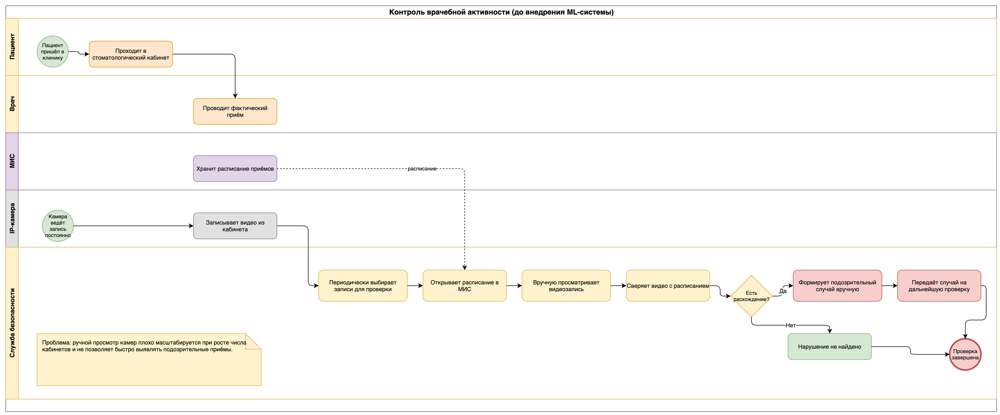
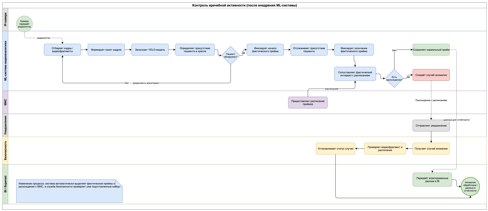
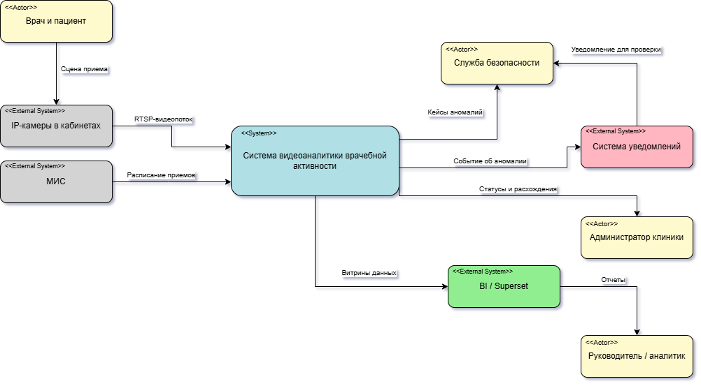
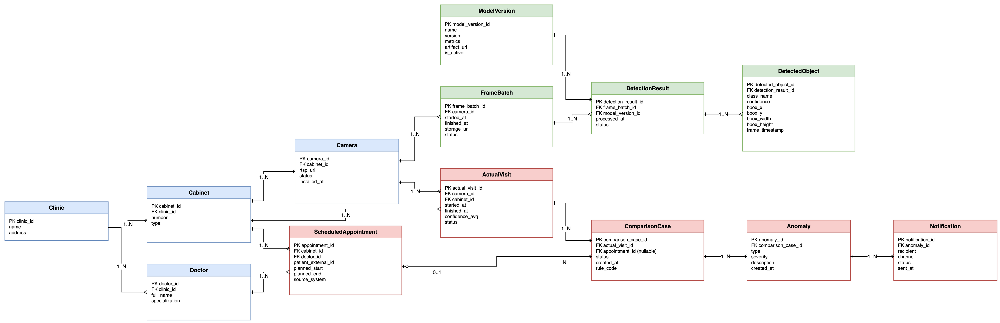
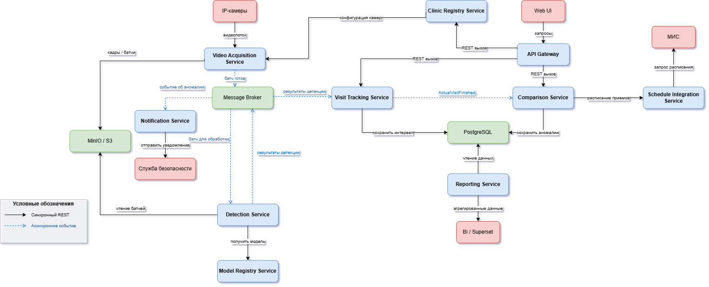
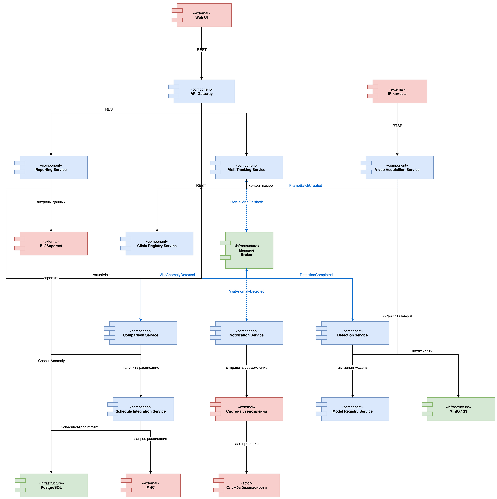
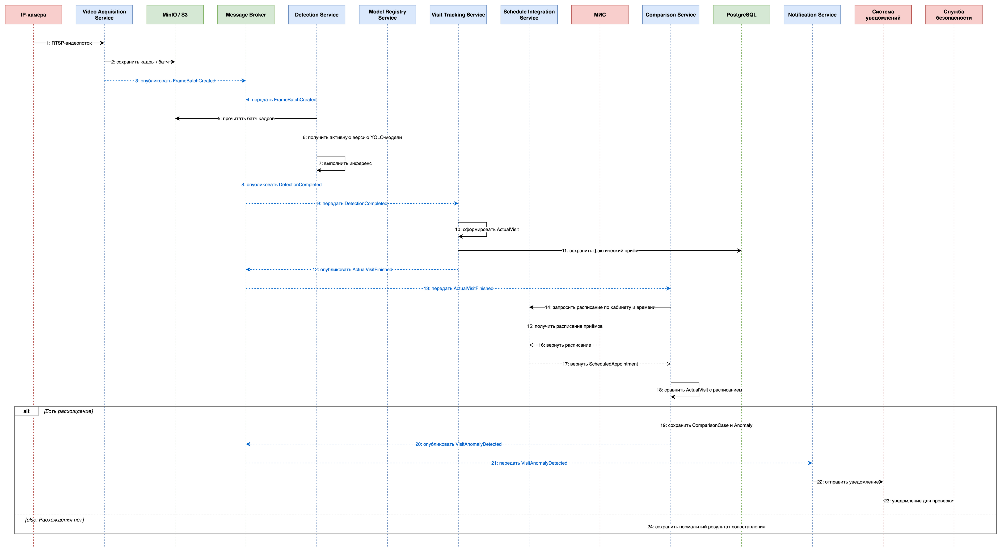

# ML-система видеоаналитики врачебной активности в стоматологических кабинетах

## Состав команды

- Анастасия Дедкова - Data Scientist, Data Engineer
- Артем Цырюльников - Software Architect, Backend Engineer

# Дизайн ML-системы - Видеоаналитика врачебной активности, MVP 1

## 1. Цели и предпосылки

### 1.1. Зачем идем в разработку продукта?

#### Бизнес-цель

В стоматологических клиниках может возникать ситуация, когда пациент фактически находится на приеме, но в медицинской информационной системе нет соответствующей официальной записи. Такой прием может проходить в обход регламента клиники и приводить к финансовым потерям, снижению прозрачности работы врачей и репутационным рискам.

Бизнес-цель продукта - автоматизировать контроль врачебной активности в стоматологических кабинетах. Система должна анализировать видеопоток с IP-камер, определять присутствие пациента в стоматологическом кресле, фиксировать фактическое время начала и окончания приема и сопоставлять эти данные с расписанием из МИС.

В результате клиника должна получить инструмент, который не заменяет службу безопасности полностью, но помогает автоматически находить подозрительные случаи и передавать их человеку на проверку.

#### Почему станет лучше, чем сейчас, от использования ML

Сейчас контроль можно выполнять вручную: сотрудник службы безопасности или администратор просматривает записи с камер и сверяет их с расписанием. Такой подход плохо масштабируется, потому что при большом количестве кабинетов требуется просматривать много видеоматериалов.

ML нужен потому, что основной источник фактической информации - это видеопоток. Обычная информационная система может работать с расписанием и статусами приемов, но не может сама определить, находится ли пациент в стоматологическом кресле. Для этого используется модель компьютерного зрения.

ML-модель выделяет из видеопотока факт присутствия пациента. После этого backend-часть системы формирует фактический интервал приема и сравнивает его с расписанием. Благодаря этому сотрудник проверяет уже подготовленные кейсы, а не весь видеопоток подряд.

#### Что будем считать успехом итерации с точки зрения бизнеса

Успехом MVP-итерации будем считать ситуацию, когда система на пилотных кабинетах стабильно определяет присутствие пациента, формирует фактические интервалы приемов и находит расхождения с расписанием.

С точки зрения бизнеса успешная итерация должна показать, что система:

- уменьшает необходимость ручного просмотра видеозаписей;
- быстрее выявляет подозрительные приемы;
- помогает службе безопасности работать с готовыми кейсами;
- может быть масштабирована на большее число кабинетов.

На уровне MVP не требуется полностью автоматизировать расследование нарушения. Достаточно, чтобы система находила подозрительный случай и передавала его ответственному сотруднику.

### 1.2. Бизнес-требования и ограничения

#### Краткое описание бизнес-требований

Основные бизнес-требования к системе:

- получать RTSP-видеопоток из стоматологических кабинетов;
- определять наличие пациента в стоматологическом кресле;
- фиксировать фактическое начало и окончание приема;
- получать расписание приемов из МИС;
- формирует результаты проверки за следующий рабочий день после обработки видеозаписей.
- сравнивать фактический прием с официальной записью;
- создавать кейс аномалии при расхождении;
- отправлять уведомление ответственному сотруднику;
- сохранять данные для отчетности и последующего анализа.

Главное бизнес-требование - система должна помогать выявлять ситуации, когда фактический прием пациента не совпадает с официальной записью в МИС.

#### Бизнес-ограничения

Система работает с видеоданными из медицинской среды, поэтому доступ к видео, кадрам и результатам обработки должен быть ограничен. Пользователи не должны напрямую обращаться к хранилищу кадров или видеофрагментов. Просмотр материалов должен выполняться только через систему с проверкой прав.

Еще одно ограничение связано с ответственностью за принятие решения. Система не должна автоматически обвинять врача в нарушении. Она только создает кейс аномалии, а финальное решение принимает сотрудник службы безопасности или другой ответственный пользователь.

Также есть ограничения по качеству видеопотока. Если камера установлена неудачно, обзор закрыт оборудованием или в кабинете плохое освещение, качество детекции может снизиться. Поэтому на пилоте важно проверять не только модель, но и условия съемки.

#### Что ожидаем от конкретной итерации

В рамках MVP ожидается проверка основной гипотезы:

> можно ли по видеопотоку автоматически определить фактический прием пациента и найти расхождение с расписанием из МИС.

В итерацию входит базовый ML-пайплайн: получение кадров, детекция пациента, построение фактического интервала и сравнение с расписанием. Также должен быть реализован простой механизм создания кейса аномалии и передачи его на проверку.

#### Описание бизнес-процесса пилота

До внедрения системы контроль врачебной активности выполняется вручную. Камеры могут использоваться в кабинетах, но сотруднику службы безопасности или администратору нужно самостоятельно просматривать видеозаписи, открывать расписание в МИС и сверять фактические события с официальными записями.

На рисунке показан бизнес-процесс контроля врачебной активности до внедрения ML-системы.

Рисунок 1 - Бизнес-процесс контроля врачебной активности до внедрения системы

На диаграмме видно, что основная нагрузка находится на сотруднике, который вручную ищет подозрительные случаи. При росте числа кабинетов такой процесс становится неудобным: проверка занимает много времени и часто выполняется уже постфактум.

После внедрения системы часть ручной проверки заменяется автоматической обработкой видеопотока. Камера передает RTSP-поток, система отбирает кадры, ML-модель определяет присутствие пациента в кресле, а backend-сервисы формируют фактический интервал приема и сравнивают его с расписанием из МИС.

На рисунке показан бизнес-процесс после внедрения ML-системы.

Рисунок 2 - Бизнес-процесс контроля врачебной активности после внедрения системы

На диаграмме видно, что ML-система не заменяет человека полностью. Она берет на себя первичный поиск подозрительных случаев, а сотрудник службы безопасности подключается уже на этапе проверки сформированного кейса аномалии.

#### Что считаем успешным пилотом

Пилот считается успешным, если система:

- стабильно получает видеопоток с пилотных камер;
- корректно определяет присутствие пациента в кресле;
- формирует фактические интервалы приемов;
- находит большую часть расхождений между фактом и расписанием;
- не создает слишком много ложных кейсов;
- укладывается в задержку выявления события около 1–3 минут.

После успешного пилота систему можно развивать дальше: подключать больше кабинетов, улучшать модель на новых данных, добавлять BI-отчеты и расширять правила сопоставления фактических приемов с расписанием.

### 1.3. Что входит в скоуп проекта/итерации, что не входит

#### Что входит в скоуп MVP

В скоуп MVP входит закрытие основных бизнес-требований, связанных с автоматическим выявлением фактического приема пациента и сравнением его с расписанием.

В MVP входит:

- получение RTSP-видеопотока с камер;
- нарезка видео на кадры или короткие фрагменты;
- подготовка датасета для модели;
- детекция пациента в стоматологическом кресле;
- расчет фактического интервала приема;
- импорт расписания из МИС;
- сравнение фактического приема с расписанием;
- создание кейса аномалии;
- базовое уведомление службы безопасности;
- сохранение результатов для дальнейшего анализа.

Главный результат MVP - рабочая цепочка от видеопотока до кейса аномалии.

#### Что не входит в скоуп MVP

В MVP не входит:

- распознавание личности пациента;
- распознавание конкретного врача по видео;
- анализ медицинских действий врача;
- автоматическое вынесение решения о нарушении;
- автоматическое переобучение модели;
- сложная BI-аналитика по всей сети клиник;
- поддержка всех возможных типов кабинетов и камер.

Эти задачи можно оставить для следующих итераций, когда будет проверено, что базовая гипотеза работает.

#### Результат с точки зрения качества кода и воспроизводимости

Результат MVP должен быть воспроизводимым. Для этого необходимо сохранить код подготовки датасета, параметры нарезки кадров, структуру датасета, версию модели, метрики обучения, скрипт инференса и описание запуска сервисов.

Для ML-части важно хранить не только сам файл модели, но и информацию о том, на каких данных она обучалась и какие метрики показала. Это позволит сравнивать версии модели между собой и безопасно обновлять модель после пилота.

#### Планируемый технический долг

В технический долг можно вынести автоматическое переобучение модели, полноценный MLOps-пайплайн, расширенный мониторинг качества модели, сложные правила обработки спорных случаев и оптимизацию стоимости хранения видео.

На MVP допустимо сделать часть процессов полуавтоматическими. Например, обновление модели может выполняться вручную после проверки качества. Главное - не потерять воспроизводимость эксперимента и возможность объяснить, какая версия модели использовалась в пилоте.

### 1.4. Предпосылки решения

В основе решения лежит предположение, что факт присутствия пациента в стоматологическом кресле можно достаточно надежно определить по кадрам с камеры. Поэтому основной ML-блок строится как задача компьютерного зрения.

Используются следующие блоки данных:

- видеопоток с IP-камер;
- кадры, полученные из видеопотока;
- разметка объектов на кадрах;
- расписание приемов из МИС;
- справочник кабинетов, врачей и камер;
- фактические интервалы приемов;
- кейсы аномалий и статусы проверки.

Гранулярность ML-модели - отдельный кадр. Модель определяет, есть ли на кадре пациент в стоматологическом кресле. Гранулярность бизнес-логики - интервал приема. Отдельные результаты детекции объединяются во временной интервал, который уже сравнивается с расписанием.

Горизонт работы системы в MVP - прошедший рабочий день клиники. Система обрабатывает видеоданные постфактум, например на следующий день после приемов, и формирует список фактических интервалов и возможных расхождений с расписанием. Такой режим проще для пилота, потому что не требует обработки видеопотока в реальном времени и позволяет сначала проверить качество детекции, правила формирования приемов и корректность сопоставления с МИС.

В качестве частоты обработки можно использовать примерно один кадр в две секунды. Это снижает вычислительную нагрузку и объем данных, но остается достаточным для определения факта нахождения пациента в кресле.

## 2. Методология

### 2.1. Постановка задачи

С технической точки зрения задача относится к области компьютерного зрения, а именно к задаче детекции объектов на изображении. Модель должна по кадру из стоматологического кабинета определить, находится ли пациент в стоматологическом кресле.

В рамках MVP модель не принимает финальное решение о нарушении. Она решает более узкую задачу: определяет факт присутствия пациента на кадрах. После этого backend-часть системы объединяет результаты детекции во временной интервал фактического приема и сравнивает его с расписанием из МИС.

Таким образом, решение состоит из двух частей. Первая часть - ML-модель, которая работает с кадрами и определяет классы `Patient` и `Empty`. Вторая часть - бизнес-логика, которая формирует объект фактического приема и проверяет его соответствие расписанию.

Такое разделение важно, потому что сама аномалия не определяется только по изображению. Пациент в кресле - это еще не нарушение. Нарушение появляется только тогда, когда фактический прием не совпадает с официальной записью в МИС.

Для решения задачи выбрана модель семейства YOLO. Такой выбор связан с тем, что YOLO подходит для детекции объектов в видеопотоке: модель достаточно быстрая, может использоваться в режиме, близком к реальному времени, и может дообучаться на собственных данных. YOLO также выбрана из-за скорости, точности и возможности дообучения на своем датасете.

### 2.2. Схема решения

В данном разделе отдельная блок-схема baseline/MVP не добавляется, чтобы не увеличивать количество диаграмм сверх требований задания. Логика решения уже частично отражена в BPMN-диаграмме процесса после внедрения, а техническая структура будет показана дальше на диаграмме архитектуры системы с распределенным хранением данных.

На уровне методологии пайплайн решения выглядит так:

1. Получить видеопоток из стоматологического кабинета.
2. Нарезать видеопоток на кадры или короткие фрагменты.
3. Отобрать качественные и неповторяющиеся кадры.
4. Разметить кадры на классы `Patient` и `Empty`.
5. Обучить модель детекции.
6. Проверить качество модели на тестовой выборке.
7. Использовать модель для определения присутствия пациента.
8. Объединить результаты детекции во временной интервал приема.
9. Сравнить фактический интервал с расписанием из МИС.
10. При расхождении создать кейс аномалии.

Baseline для сравнения - это текущий ручной процесс: сотрудник службы безопасности просматривает видеозаписи и вручную сверяет их с расписанием. MVP отличается тем, что первичный поиск фактических приемов выполняется автоматически с помощью ML-модели, а человек проверяет уже подготовленные кейсы.

### 2.3. Этапы решения задачи

#### Этап 1. Подготовка данных

Первый этап - подготовка данных для обучения и проверки модели. Источником данных являются видеозаписи из стоматологических кабинетов. Видеозаписи собираются непосредственно из кабинетов, а для передачи потока используется RTSP. Запись выполняется через OpenCV, каждая видеозапись охватывает полный рабочий день с 8:00 до 20:00, что позволяет собрать разные сценарии работы кабинета и разное освещение.

Для обучения модели нужны не все кадры подряд. Если использовать слишком много похожих изображений, модель может переобучиться на однотипные сцены. Поэтому из видео выбираются кадры с разными условиями: пациент в кресле, пустое кресло, врач рядом с пациентом, разные ракурсы, разная освещенность и разная расстановка оборудования.

После сбора данных выполняется удаление похожих кадров, затем кадры размечались вручную. Датасет сохраняется в формате COCO, разметить нужно не менее 4000 кадров из разных кабинетов. Сделать это можно в Label Studio или CVAT.

Для MVP используются два основных класса:

| Целевая переменная | Описание |
|---|---|
| `Patient` | Пациент находится в стоматологическом кресле |
| `Empty` | Пациент отсутствует, кресло пустое или прием не идет |

Основные данные и признаки для обучения модели:

| Данные / признаки | Источник | Для чего используются |
|---|---|---|
| Кадры из видеопотока | IP-камеры, RTSP | Обучение и тестирование модели |
| Bounding box пациента | Ручная разметка | Обучение детекции объекта |
| Класс объекта | Разметка `Patient` / `Empty` | Классификация состояния кадра |
| Временная метка кадра | Видеопоток | Формирование интервала приема |
| ID камеры и кабинета | Справочник камер | Привязка результата к кабинету |
| Расписание приема | МИС | Сравнение факта с планом |

Результатом этапа подготовки данных должен быть воспроизводимый датасет: изображения, разметка, список классов, описание источников и правила отбора кадров.

#### Этап 2. Обучение и выбор модели

На втором этапе обучается модель детекции. Для MVP выбирается модель семейства YOLO, потому что она дает хороший баланс между качеством и скоростью обработки.

Можно попробовать обучить несколько моделей. Для выбора одной из них учитывать mAP@50 и вес модели.

Для MVP это важно, потому что модель должна быть не только точной, но достаточно быстрой и легкой. Если модель будет слишком тяжелой, обработка видеопотока из нескольких кабинетов станет дорогой и медленной.

Формирование выборки выполнять через разделение данных на train, validation и test. При этом важно, чтобы в тестовую выборку попадали кадры, которые модель не видела при обучении. Желательно также проверять модель на разных кабинетах, чтобы оценить, насколько хорошо она переносится на новые условия.

#### Этап 3. Метрика качества модели

Во время обучения модели основной метрикой качества является `mAP@50`. Эта метрика используется для оценки качества детекции объектов и показывает среднюю точность модели при пороге пересечения bounding box `IoU = 0.5`.

Для нашего проекта `mAP@50` подходит, потому что модель решает задачу объектной детекции: она должна находить пациента на кадре и корректно определять область, где он находится. В исходной ML-части проекта целевой ориентир был сформулирован как достижение качества выше `0.7` по `mAP@50`.

При этом `precision`, `recall` и `F1-score` не используются как основные метрики обучения. Их корректнее оценивать постфактум на пилоте, когда результаты системы будут сравнены с ручной проверкой видеозаписей и расписания. Это связано с тем, что разметка относится к кадрам и bounding box, а не к полному набору фактических приемов и аномалий за рабочий день.

Таким образом, на этапе обучения оценивается качество CV-модели по `mAP@50`, а на этапе пилота дополнительно проверяется бизнес-качество всей системы: какие фактические приемы были найдены, какие кейсы оказались ложными и какие события система могла пропустить.

#### Этап 4. Формирование фактического интервала приема

Результат детекции на одном кадре еще не является фактическим приемом. Для бизнеса важен не отдельный кадр, а временной интервал: когда пациент появился в кресле, сколько длился прием и когда он закончился.

Поэтому результаты модели объединяются во временную последовательность. Если несколько кадров подряд показывают наличие пациента, система фиксирует начало фактического приема. Если пациент долго не обнаруживается, система фиксирует окончание приема.

Короткие пропуски можно сглаживать. Например, если пациента на одном кадре закрывает врач или оборудование, это не должно сразу завершать прием. Для этого можно использовать простые правила: минимальная длительность приема, допустимый разрыв между кадрами и минимальное число подтверждений присутствия.

На выходе этапа формируется сущность `ActualVisit`, которая содержит кабинет, камеру, время начала, время окончания, длительность и ссылки на подтверждающие кадры или видеофрагменты.

#### Этап 5. Интеграция бизнес-правил

После формирования фактического интервала система сравнивает его с расписанием из МИС. Если для найденного интервала есть подходящая запись, прием считается нормальным. Если записи нет или время сильно отличается от планового, создается кейс аномалии.

На этом этапе ML уже не используется напрямую. Работают бизнес-правила:

- есть ли запись в МИС на этот кабинет и период;
- попадает ли фактический интервал в допустимое отклонение;
- насколько серьезное расхождение найдено.

Такой подход выбран потому, что аномалия - это не чисто ML-задача. ML-модель определяет факт присутствия пациента, а Comparison Service уже решает, является ли этот факт нарушением относительно расписания.

#### Этап 6. Подготовка результата для пилота

Финальный результат MVP - не просто обученная модель, а рабочая цепочка от видеопотока до кейса аномалии. Для пилота система должна сохранять результаты так, чтобы их можно было проверить вручную.

На выходе пилота должны быть:

- список фактических приемов;
- список найденных расхождений;
- кейсы аномалий;
- ссылки на подтверждающие кадры или видеофрагменты;
- метрики качества модели;
- метрики бизнес-процесса: количество найденных кейсов, доля ложных срабатываний и время до создания кейса.

Результаты пилота сравниваются с ручной проверкой. Это позволит понять, достаточно ли хорошо работает модель и действительно ли система снижает ручную нагрузку.

#### Риски методологии

Основные риски связаны с качеством данных и переносимостью модели на новые кабинеты. Камеры могут иметь разные углы обзора, в кабинетах может отличаться освещение, пациента может закрывать врач или оборудование. Также возможны спорные случаи, когда человек находится рядом с креслом, но прием еще не начался.

Для снижения рисков в MVP используется ограниченная постановка задачи: модель определяет только присутствие пациента, а не распознает личность, действия врача или медицинскую процедуру. Более сложные задачи можно добавить после пилота.

## 3. Подготовка пилота

### 3.1. Способ оценки пилота

Пилот предлагается провести на ограниченном количестве стоматологических кабинетов, например на 2–3 кабинетах в течение 2–4 недель. Такой масштаб позволяет проверить систему на реальных видеопотоках, но при этом не требует сразу подключать всю сеть клиник.

Во время пилота система будет работать параллельно с текущим процессом контроля. IP-камеры передают видеопоток, ML-модель определяет присутствие пациента в кресле, система формирует фактические интервалы приемов и сравнивает их с расписанием из МИС. Если найдено расхождение, создается кейс аномалии.

Оценка пилота строится через сравнение результатов системы с ручной проверкой. Для выбранных дней сотрудник службы безопасности или администратор вручную проверяет видеозаписи и расписание. После этого результаты сравниваются с тем, что нашла система.

Проверяются три уровня результата:

1. корректно ли модель определяет пациента в кресле;
2. правильно ли система формирует фактические интервалы приемов;
3. совпадают ли найденные системой аномалии с ручной проверкой.

Такой способ оценки удобен, потому что он сравнивает систему не только по ML-метрикам, но и по реальному бизнес-процессу.

### 3.2. Что считаем успешным пилотом

Пилот считается успешным, если система показывает, что автоматический контроль врачебной активности реально снижает объем ручной проверки и помогает находить подозрительные случаи быстрее, чем текущий процесс.

Для оценки успешности используются несколько групп метрик.

На этапе обучения модели основной технической метрикой является `mAP@50`. Она показывает, насколько хорошо модель детектирует пациента на размеченных кадрах.

`Precision`, `recall` и `F1-score` для итогового бизнес-сценария оцениваются уже постфактум после пилота. Для этого найденные системой фактические приемы и кейсы аномалий сравниваются с ручной проверкой видеозаписей и расписания. Это важно, потому что текущий датасет размечен на уровне кадров, а не на уровне всех приемов и аномалий за рабочий день.

К бизнес-метрикам относятся количество найденных фактических приемов, количество найденных расхождений с расписанием, доля подтвержденных аномалий и среднее время от фактического события до создания кейса.

Для MVP можно считать пилот успешным, если:

- система стабильно получает видеопоток с пилотных камер;
- модель достигает целевого значения `mAP@50` на тестовой выборке;
- фактические интервалы приемов формируются без частого дробления одного приема на несколько частей;
- найденные системой кейсы можно проверить вручную по видеофрагментам и расписанию;
- служба безопасности не перегружается большим количеством нерелевантных кейсов;
- кейсы по прошедшему рабочему дню формируются до начала следующего цикла ручной проверки.

Важно, что на пилоте система не обязана идеально работать во всех возможных ситуациях. Главная цель пилота - проверить основную гипотезу: можно ли по видеопотоку автоматически выделять фактические приемы и находить подозрительные расхождения с МИС.

### 3.3. Подготовка пилота

Для запуска пилота нужно заранее подготовить камеры, данные, модель, интеграции и процесс ручной проверки.

Сначала выбираются пилотные кабинеты. Лучше брать кабинеты с разными условиями: разный ракурс камеры, разное освещение, разная загруженность врачей. Это позволит понять, насколько модель устойчива к реальным условиям работы.

Далее проверяется качество видеопотока. Камера должна стабильно передавать RTSP-поток, пациент в кресле должен быть виден на кадре, а обзор не должен постоянно перекрываться оборудованием или мебелью. Если камера установлена слишком неудобно, качество ML-детекции может быть ниже независимо от самой модели.

Затем готовится датасет для пилота. Из видеозаписей выбранных кабинетов нарезаются кадры, удаляются дублирующиеся изображения и выполняется разметка классов `Patient` и `Empty`. После этого модель обучается или дообучается на подготовленных данных и проверяется на отдельной тестовой выборке.

Также нужно подготовить интеграцию с МИС. Для пилота достаточно получать расписание по выбранным кабинетам и рабочим дням. Полная интеграция со всеми функциями МИС на MVP не требуется, но данные о времени приема, кабинете и враче должны быть доступны для сопоставления.

С точки зрения вычислений пилот можно запускать в ограниченном режиме. Например, анализировать не весь видеопоток, а один кадр примерно раз в две секунды. Это снижает нагрузку на вычисления и хранилище, но остается достаточным для определения факта присутствия пациента.

Перед запуском пилота нужно договориться, кто будет вручную проверять результаты системы. Без ручной проверки нельзя понять, какие кейсы были действительно корректными, а какие являются ложными срабатываниями. Поэтому для пилота обязательно нужен небольшой процесс разметки результата: подтверждено, не подтверждено, спорный случай.

Итогом подготовки пилота должны быть:

- выбранные пилотные кабинеты;
- настроенный доступ к RTSP-потокам;
- подготовленный и размеченный датасет;
- обученная версия модели;
- базовая интеграция с расписанием из МИС;
- правила формирования фактического приема;
- критерии создания кейса аномалии;
- процесс ручной проверки результатов;
- список метрик, по которым будет оцениваться пилот.

После этого можно запускать пилот и собирать результаты для решения: расширять систему дальше, дорабатывать модель или менять правила сопоставления.

## 4. Внедрение для production-системы

### 4.1. Архитектура решения

Production-версия системы строится как микросервисная ML-система. Основная идея заключается в том, что обработка видеопотока, ML-инференс, формирование фактических приемов, интеграция с МИС, выявление аномалий и уведомления разделены между разными сервисами.

Такое разделение нужно потому, что разные части системы имеют разную нагрузку. Например, Video Acquisition Service и Detection Service зависят от количества камер и объема видеоданных, а Comparison Service и Notification Service больше связаны с бизнес-логикой и количеством найденных событий.

Сначала покажем систему на уровне внешнего окружения. Контекстная диаграмма нужна, чтобы отделить разрабатываемую ML-систему от внешних участников и систем: IP-камер, МИС, службы безопасности, администратора клиники, BI / Superset и системы уведомлений.

Рисунок 3 - Контекстная диаграмма системы видеоаналитики врачебной активности

На диаграмме видно, что система получает RTSP-видеопоток от IP-камер и расписание приемов из МИС. В результате работы система передает кейсы аномалий службе безопасности, статусы и расхождения администратору клиники, а также витрины данных в BI / Superset. Система уведомлений вынесена как внешний компонент, потому что она отвечает за доставку сообщения ответственному сотруднику.

Основные компоненты системы:

- **API Gateway** - единая точка входа для UI и внешних клиентов;
- **Clinic Registry Service** - хранит данные о клиниках, кабинетах, врачах и камерах;
- **Video Acquisition Service** - получает RTSP-потоки и формирует батчи кадров;
- **Detection Service** - запускает YOLO-модель и определяет наличие пациента;
- **Visit Tracking Service** - формирует фактические интервалы приемов;
- **Schedule Integration Service** - получает расписание из МИС;
- **Comparison Service** - сравнивает фактические приемы с расписанием;
- **Notification Service** - отправляет уведомления об аномалиях;
- **Reporting Service** - готовит данные для BI-отчетности;
- **Model Registry Service** - хранит версии ML-моделей и метрики качества.

Данные в системе хранятся распределенно. Кадры, видеофрагменты и тяжелые ML-артефакты сохраняются в MinIO / S3. Операционные данные сервисов хранятся в PostgreSQL. При этом логически каждый сервис владеет своей схемой или своими таблицами. BI / Superset работает не напрямую с видеопотоком, а с подготовленными витринами и агрегированными данными.

Рисунок 4 - ER-диаграмма структуры данных системы

На ER-диаграмме показаны основные сущности системы: камера, кабинет, врач, батч кадров, результат детекции, фактический прием, плановая запись, кейс сопоставления, аномалия, уведомление и версия модели. Эта диаграмма важна, потому что показывает, какие данные относятся к ML-части, а какие - к бизнес-логике сопоставления с расписанием.

Далее представлена общая архитектура системы с учетом распределенного хранения данных.

Рисунок 5 - Архитектура ML-системы и распределенного хранения данных

На архитектурной диаграмме видно, что система не хранит все данные в одном месте. Видеофрагменты и кадры находятся в MinIO / S3, операционные сущности - в PostgreSQL, события между сервисами передаются через Message Broker, агрегированные данные уходят в BI / Superset. Такое распределение выбрано потому, что видеоданные имеют большой объем, а бизнес-данные требуют структурированного хранения и целостности.

Основной поток обработки выглядит следующим образом. IP-камера передает RTSP-видеопоток в Video Acquisition Service. Этот сервис отбирает кадры, сохраняет их в MinIO / S3 и публикует событие о создании батча. Detection Service получает задание через брокер, запускает YOLO-модель и сохраняет результат детекции. Visit Tracking Service на основе результатов детекции формирует ActualVisit. Затем Comparison Service сравнивает фактический прием с расписанием из МИС. Если найдено расхождение, создается аномалия и Notification Service отправляет уведомление службе безопасности.

### 4.2. Описание инфраструктуры и масштабируемости

Для production-развертывания лучше использовать закрытый контур клиники или медицинской сети. Это может быть on-premise инфраструктура или private cloud. Такой выбор связан с тем, что система работает с видеопотоками из медицинской среды, а значит, важно контролировать хранение данных, сетевой доступ и безопасность.

Сервисы системы разворачиваются в контейнерах. Для MVP можно использовать Docker Compose, но для production-версии лучше подходит Kubernetes. Он позволяет управлять репликами сервисов, перезапускать упавшие контейнеры, задавать лимиты ресурсов и отдельно масштабировать нагруженные компоненты.

В первую очередь масштабируются Video Acquisition Service и Detection Service. Первый зависит от количества камер, второй - от количества кадров и сложности ML-инференса. Detection Service можно выносить на отдельные GPU-узлы, если CPU-ресурсов недостаточно.

Message Broker используется для сглаживания нагрузки. Если кадров поступает больше, чем модель успевает обработать, задания не теряются, а накапливаются в очереди. При увеличении числа обработчиков Detection Service очередь постепенно уменьшается.

Плюсы выбранного подхода:

- можно масштабировать ML-инференс отдельно от бизнес-сервисов;
- видеоданные не передаются напрямую между всеми сервисами;
- события позволяют не блокировать обработку при временных задержках;
- модель можно обновлять отдельно через Model Registry Service;
- архитектура подходит для постепенного подключения новых кабинетов.

Минусы:

- система становится сложнее, чем монолит;
- нужно следить за очередями, событиями и версиями контрактов;
- требуется мониторинг инфраструктуры;
- нужно аккуратно управлять доступами к видеоданным.

Финальный выбор микросервисной архитектуры лучше монолита, потому что система работает с разнородной нагрузкой: видео, ML, расписание, уведомления и отчеты. Если объединить все в один сервис, будет сложнее масштабировать обработку видео и независимо обновлять модель.

### 4.3. Требования к работе системы

Для MVP система работает в постобработке: видеоданные за рабочий день анализируются после завершения приемов или на следующий день. Такой режим подходит для пилота, потому что основная цель MVP - проверить качество детекции пациента и корректность сопоставления фактических приемов с расписанием, а не обеспечить мгновенную реакцию.

Ориентировочные требования:

- доступность системы во время пакетной обработки видеоданных - около 99,5%;
- срок формирования результатов - до следующего рабочего дня после анализируемой смены;
- частота анализа - примерно 1 кадр в 2 секунды на камеру;
- масштабирование - от нескольких кабинетов на пилоте до десятков или сотен камер при развитии;
- результаты обработки кадров, фактические интервалы и кейсы аномалий не должны теряться;
- бизнес-сервисы могут обновляться 1–2 раза в неделю;
- ML-модель обновляется реже, после проверки качества.

Для пользовательских запросов через UI требования по RPS невысокие, потому что основная нагрузка создается не пользователями, а видеопотоками и ML-инференсом. Поэтому главный показатель производительности - не число запросов к API, а задержка обработки кадров, размер очередей и время создания кейса аномалии.

### 4.4. Безопасность системы

Система работает в медицинской среде, поэтому безопасность является одним из ключевых требований. Все пользовательские запросы должны проходить через API Gateway. Он проверяет токены, маршрутизирует запросы и ограничивает доступ к внутренним сервисам.

Для аутентификации можно использовать корпоративную учетную запись или OAuth2 / OpenID Connect. Авторизация строится на ролях:

- администратор клиники видит статусы кабинетов и фактические приемы;
- служба безопасности видит кейсы аномалий и материалы для проверки;
- руководитель или аналитик получает агрегированные отчеты;
- технический администратор управляет камерами и интеграциями;
- ML-инженер работает с версиями модели и метриками качества.

Доступ должен ограничиваться не только по роли, но и по клинике. Если система используется в сети клиник, пользователь одной клиники не должен видеть данные другой клиники.

Потенциальные уязвимости системы:

- несанкционированный доступ к видеокадрам;
- доступ к RTSP-потокам камер из внешней сети;
- утечка токенов сервисных учетных записей;
- некорректная настройка прав в MinIO / S3;
- отсутствие аудита действий пользователей;
- подмена событий между сервисами.

Для снижения рисков камеры должны находиться в закрытом сетевом сегменте. Доступ к MinIO / S3 получают только сервисы по сервисным учетным записям. Пользователи не должны открывать объектное хранилище напрямую: просмотр кадров и видеофрагментов должен идти через API с проверкой прав.

### 4.5. Безопасность данных

Система обрабатывает чувствительные данные: видеопоток из стоматологических кабинетов, расписание приемов, данные о врачах, кабинетах и фактическом времени приема. Поэтому данные должны храниться и передаваться с учетом ограничений медицинской среды.

Внешние соединения защищаются через HTTPS. Внутренние соединения между сервисами также желательно защищать, особенно если сервисы развернуты не на одном физическом сервере. Секреты, пароли, ключи доступа к MinIO / S3 и параметры подключения к МИС не должны храниться в коде.

Для видео и кадров важно ограничить срок хранения. В MVP можно хранить не весь видеопоток, а только кадры и короткие фрагменты, связанные с фактическими приемами и кейсами аномалий. Это снижает объем хранилища и уменьшает риск утечки лишних данных.

Также нужен аудит действий. Система должна фиксировать, кто открыл кейс аномалии, кто просмотрел видеофрагмент, кто изменил статус кейса и когда это произошло. Это важно для внутреннего контроля и расследования спорных ситуаций.

### 4.6. Издержки

Основные издержки системы связаны не с пользовательскими запросами, а с обработкой и хранением видеоданных. На стоимость влияют количество камер, частота отбора кадров, длительность хранения видеофрагментов, число запусков ML-модели и необходимость GPU-ресурсов.

Основные группы затрат:

- вычисления для Detection Service;
- хранение кадров и видеофрагментов в MinIO / S3;
- PostgreSQL для операционных данных;
- Message Broker для событий;
- инфраструктура Kubernetes или серверы для контейнеров;
- мониторинг, логирование и резервное копирование;
- работа сотрудников на ручную проверку кейсов.

На MVP издержки можно снизить за счет ограничений: подключить только несколько кабинетов, анализировать примерно один кадр в две секунды, хранить не весь видеопоток, а только фрагменты, связанные с событиями, и обновлять модель вручную после проверки качества.

Точный расчет стоимости нужно делать после эксперимента с пилотными камерами. На этом этапе можно измерить средний объем данных на одну камеру, время обработки кадра, размер очереди и потребность в CPU/GPU.

### 4.7. Integration points

Система интегрируется с несколькими внешними и внутренними компонентами. Внешние точки интеграции: IP-камеры, МИС, система уведомлений и BI / Superset. Внутренние точки интеграции - REST API между сервисами и асинхронные события через Message Broker.

Перед описанием интеграций покажем структурную UML-диаграмму компонентов.

Рисунок 6 - UML-диаграмма компонентов системы

На UML-диаграмме компонентов показано, какие сервисы входят в систему и какие зависимости между ними существуют. Она дополняет архитектурную схему, потому что показывает систему именно с точки зрения программных компонентов и их интерфейсов.

Основные REST-интеграции:

- Web UI обращается к API Gateway;
- API Gateway запрашивает данные у Clinic Registry Service, Comparison Service, Visit Tracking Service и Reporting Service;
- Schedule Integration Service получает расписание из МИС;
- Reporting Service передает агрегированные данные для BI / Superset;
- Model Registry Service предоставляет Detection Service информацию об активной версии модели.

Основные асинхронные события:

- `FrameBatchCreated` - создан батч кадров для обработки;
- `DetectionCompleted` - завершена обработка батча моделью;
- `PatientPresenceDetected` - обнаружено присутствие пациента;
- `ActualVisitStarted` - зафиксировано начало фактического приема;
- `ActualVisitFinished` - зафиксировано окончание фактического приема;
- `VisitMatchedWithSchedule` - фактический прием сопоставлен с расписанием;
- `VisitAnomalyDetected` - найдено расхождение с расписанием;
- `NotificationSent` - уведомление отправлено.

Для сценария выявления аномального приема используется UML-диаграмма последовательности.

Рисунок 7 - UML-диаграмма последовательности сценария выявления аномалии

На диаграмме последовательности показан основной сценарий: камера передает видеопоток, система формирует батч кадров, Detection Service выполняет инференс, Visit Tracking Service формирует фактический прием, Comparison Service сравнивает его с расписанием и при расхождении запускает уведомление службы безопасности.
Основные REST-интеграции:

- Web UI обращается к API Gateway;
- API Gateway запрашивает данные у Clinic Registry Service, Comparison Service, Visit Tracking Service и Reporting Service;
- Schedule Integration Service получает расписание из МИС;
- Reporting Service передает агрегированные данные для BI / Superset;
- Model Registry Service предоставляет Detection Service информацию об активной версии модели.

Основные асинхронные события:

- `FrameBatchCreated` - создан батч кадров для обработки;
- `DetectionCompleted` - завершена обработка батча моделью;
- `PatientPresenceDetected` - обнаружено присутствие пациента;
- `ActualVisitStarted` - зафиксировано начало фактического приема;
- `ActualVisitFinished` - зафиксировано окончание фактического приема;
- `VisitMatchedWithSchedule` - фактический прием сопоставлен с расписанием;
- `VisitAnomalyDetected` - найдено расхождение с расписанием;
- `NotificationSent` - уведомление отправлено.

Для сценария выявления аномального приема используется UML-диаграмма последовательности.

Рисунок 6 - UML-диаграмма последовательности сценария выявления аномалии

На диаграмме последовательности показан основной сценарий: камера передает видеопоток, система формирует батч кадров, Detection Service выполняет инференс, Visit Tracking Service формирует фактический прием, Comparison Service сравнивает его с расписанием и при расхождении запускает уведомление службы безопасности.

### 4.8. Риски

Основные риски проекта можно разделить на технические, ML-риски, интеграционные и организационные.

К техническим рискам относятся недоступность камер, потеря RTSP-потока, рост очередей, нехватка вычислительных ресурсов для ML-инференса и переполнение хранилища видеофрагментов. Для снижения этих рисков нужны мониторинг камер, контроль очередей, горизонтальное масштабирование Detection Service и политики хранения данных.

ML-риски связаны с качеством модели. Модель может хуже работать на новых кабинетах, при другом освещении, нестандартном расположении камеры или перекрытии пациента врачом. Для снижения риска нужно расширять датасет, проверять модель на новых кабинетах и хранить версии моделей в Model Registry Service.

Интеграционные риски связаны с МИС и системой уведомлений. Если МИС временно недоступна, система может сформировать фактический прием, но не сможет сразу выполнить сопоставление. В таком случае событие должно быть обработано позже. Если система уведомлений недоступна, уведомление должно быть отправлено повторно.

Организационный риск связан с тем, что сотрудники могут воспринимать систему как инструмент наказания. Поэтому важно правильно описать роль системы: она не обвиняет врача автоматически, а только создает кейсы для проверки. Финальное решение остается за ответственным сотрудником.

Также есть риск большого числа ложных срабатываний. Если служба безопасности будет получать слишком много нерелевантных кейсов, доверие к системе снизится. Поэтому на пилоте нужно отдельно отслеживать долю подтвержденных аномалий и корректировать пороги модели и правила сопоставления.

## 5. Заключение

В результате работы получился дизайн-документ ML-системы для видеоаналитики врачебной активности в стоматологических кабинетах. В документе удалось описать бизнес-проблему, ML-подход, подготовку пилота, production-архитектуру, инфраструктуру, риски и диаграммы. Главное, что получилось - связать модель компьютерного зрения не просто с технической задачей детекции пациента, а с реальным бизнес-процессом: выявлением фактических приемов и расхождений с расписанием из МИС.

Работа не сразу шла ровно, потому что в проекте смешались две большие части: ML System Design и архитектура информационной системы. Мне (Насте) было сложнее разбираться в backend-части, микросервисах, интеграциях и инфраструктуре. Артему, наоборот, было сложнее погружаться в ML-часть: датасеты, метрики качества модели, разметку и особенности инференса. Но в итоге мы смогли разделить зоны ответственности и найти общий язык: я больше занималась ML, данными и методологией, а Артем - архитектурой, сервисами и backend-логикой.

Эта работа была полезной, потому что помогла увидеть ML-проект не только как обучение модели, а как полноценную систему, которая должна встраиваться в бизнес-процесс, иметь хранилища, интеграции, мониторинг, безопасность и понятные критерии пилота. Также стало понятнее, что хорошие ML-метрики сами по себе не гарантируют пользы: важно связать precision, recall, mAP и latency с бизнес-результатом, например с количеством найденных аномалий и нагрузкой на службу безопасности.

Не очень удобным было то, что в задании одновременно требуется следовать шаблону ML System Design Doc и добавить набор диаграмм из классического проектирования информационных систем. Из-за этого сначала было неочевидно, куда именно вставлять BPMN, ER-диаграмму, UML-диаграммы и архитектурные схемы, чтобы они не выглядели отдельными файлами без связи с текстом. Возможно, задание было бы проще выполнять, если бы сразу был пример структуры репозитория и пример того, как диаграммы должны быть встроены в мастер-документ.
В текущей версии основной упор сделан на MVP и проверку главной гипотезы: можно ли по видеопотоку автоматически находить фактические приемы и сопоставлять их с расписанием.

